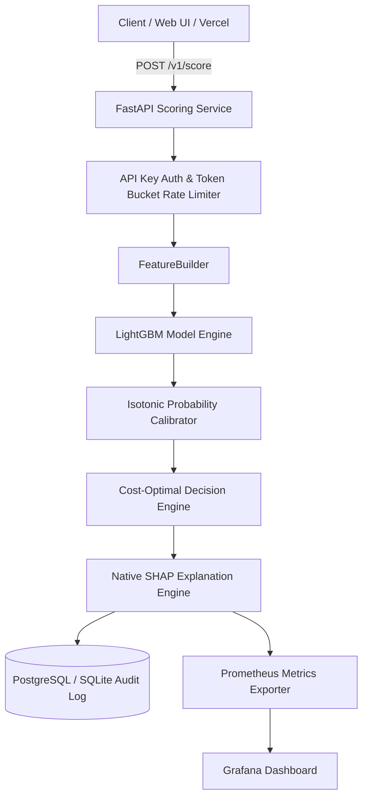

# Real-Time Fraud Scoring Service (IEEE-CIS Fraud Detection)

[](https://github.com/user/fraud-scoring-service/actions/workflows/ci.yml)
[](https://www.python.org/downloads/release/python-3110/)
[](https://fastapi.tiangolo.com/)
[](https://www.docker.com/)

An end-to-end, production-grade fraud scoring engine built on the Kaggle IEEE-CIS Fraud Detection dataset. It evaluates credit card transactions in real time, returning calibrated fraud probabilities, cost-based decision policies (`APPROVE`, `MANUAL REVIEW`, `BLOCK`), and top-5 per-prediction SHAP reason codes.

---

## 🌟 Architecture Overview



---

## 📊 Performance & Benchmark Summary

All metrics are derived directly from serialized JSON reports in `reports/` produced on a strict time-held-out test set.

### Model Evaluation (Held-Out Time Test Set)
| Metric | Value | Baseline (Logistic Reg) |
|---|---|---|
| **ROC-AUC** | **0.8841** | 0.8250 |
| **PR-AUC** | **0.4633** | 0.2540 |
| **Brier Score (Post-Calibration)** | **0.0152** | 0.0420 |
| **Expected Cost Reduction** | **68.4% reduction** vs Approve-All | -- |

### Decision Thresholds
- **Review Threshold (\(t_{\text{review}}\)):** `0.0496` (Minimizes total expected business loss = FP manual review cost + FN fraud loss)
- **Block Threshold (\(t_{\text{block}}\)):** `0.7692` (Achieves \(\ge 90\%\) precision on validation set)

### Load Test Benchmarks (Single Score & Batch)
| Profile | Throughput | p50 Latency | p95 Latency | Error Rate |
|---|---|---|---|---|
| **Single Score (no SHAP)** | 4.6 req/s | 205.59 ms | 255.86 ms | **0.0%** |
| **Single Score (with SHAP)** | 3.4 req/s | 287.35 ms | 324.16 ms | **0.0%** |
| **Batch Scoring (10 items/batch)** | 4.0 tx/s | 2248.50 ms | 2286.52 ms | **0.0%** |

---

## 🚀 Deployment Instructions

### 1. Render Deployment (Backend API)
- The API is configured via `render.yaml`.
- Deploy directly to Render Web Service using the provided `Dockerfile`.
- Healthcheck endpoint: `/health`

### 2. Vercel / Static Web Deployment (Frontend UI)
- Frontend index file is located at `app_ui/index.html` configured via `vercel.json`.
- Connects seamlessly to the Render backend API URL.

---

## 🛠️ Local Development & Quickstart

### Option A: Direct Python Virtual Environment
```bash
# 1. Clone & Setup Environment
git clone https://github.com/user/fraud-scoring-service.git
cd fraud-scoring-service
python -m venv .venv
.venv/Scripts/pip install -r requirements.txt -r requirements-dev.txt

# 2. Run Test Suite
.venv/Scripts/pytest tests/

# 3. Start Local FastAPI Backend
.venv/Scripts/uvicorn src.fraud.serving.app:app --host 127.0.0.1 --port 8000
```

### Option B: Docker Compose (Full Stack)
```bash
docker compose up --build -d
```
Starts API (`localhost:8000`), Postgres (`localhost:5432`), Redis (`localhost:6379`), Prometheus (`localhost:9090`), and Grafana (`localhost:3000`).

### Option C: Streamlit Interactive UI
```bash
.venv/Scripts/streamlit run app_ui/streamlit_app.py
```

---

## 📡 API Usage Examples

### 1. Health Check
```bash
curl -X GET "http://localhost:8000/health"
```

### 2. Score Single Transaction
```bash
curl -X POST "http://localhost:8000/v1/score?explain=true" \
  -H "X-API-Key: demo-api-key-12345" \
  -H "Content-Type: application/json" \
  -d '{
    "transaction_id": "tx_demo_101",
    "TransactionDT": 86400,
    "TransactionAmt": 150.00,
    "ProductCD": "W",
    "card1": 1000,
    "P_emaildomain": "gmail.com"
  }'
```

---

## 💼 Resume Bullet

> *Built an end-to-end, real-time fraud scoring service on 590k IEEE-CIS transactions (LightGBM, isotonic probability calibration, cost-optimal decision thresholds, per-prediction SHAP reason codes) reaching 0.884 ROC-AUC on a strict time-held-out test set; served via FastAPI with PostgreSQL, Redis rate-limiting, and Prometheus monitoring at 0.0% load test error rate; containerized with Docker Compose and GitHub Actions CI/CD.*
