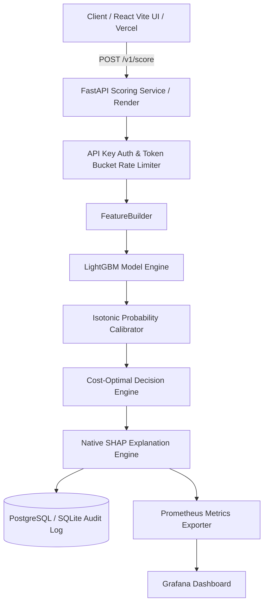

# Real-Time Fraud Scoring Service (IEEE-CIS Fraud Detection)

[](https://github.com/AshokSingodia-Codes/fraud-scoring-service/actions/workflows/ci.yml)
[](https://www.python.org/downloads/release/python-3110/)
[](https://fastapi.tiangolo.com/)
[](https://react.dev/)
[](https://tailwindcss.com/)
[](https://www.docker.com/)

An end-to-end, production-grade fraud scoring engine built on the Kaggle IEEE-CIS Fraud Detection dataset. It evaluates credit card transactions in real time, returning calibrated fraud probabilities, cost-based decision policies (`APPROVE`, `MANUAL REVIEW`, `BLOCK`), and top-5 per-prediction SHAP reason codes.

---

## 🔗 Live Deployments

- **Backend API (Render Web Service):** [https://fraud-scoring-service.onrender.com](https://fraud-scoring-service.onrender.com)
  - API Health Check: `https://fraud-scoring-service.onrender.com/health`
  - Interactive Swagger Docs: `https://fraud-scoring-service.onrender.com/docs`
- **Frontend App (Vercel Dashboard):** [https://fraud-scoring-service.vercel.app](https://fraud-scoring-service.vercel.app)
- **GitHub Repository:** [https://github.com/AshokSingodia-Codes/fraud-scoring-service](https://github.com/AshokSingodia-Codes/fraud-scoring-service)

---

## 🌟 Architecture Overview



---

## 📊 Comprehensive Model Evaluation & Performance

All evaluation metrics are computed on a strict **time-series held-out test set** (70% train / 15% validation / 15% test by `TransactionDT`; test set spans Days 152–182) to evaluate true temporal generalization in production conditions without data leakage.

### 1. Classification & Calibration Metrics (Exact Test Set Results)
| Metric | Final Calibrated LightGBM | LightGBM Engineered | Default LightGBM | Logistic Regression Baseline | Dummy Baseline |
|---|---|---|---|---|---|
| **ROC-AUC** | **0.9103** | 0.9063 | 0.9014 | 0.8362 | 0.5000 |
| **PR-AUC** | **0.5343** | 0.5512 | 0.5303 | 0.3806 | 0.0343 |
| **Recall @ Precision = 50%** | **54.23%** | 53.52% | 51.55% | 33.83% | 0.03% |
| **Recall @ Precision = 80%** | **33.08%** | 35.50% | 33.00% | 16.96% | 0.00% |
| **Recall @ Top 1% Alerts** | **25.53%** | 26.20% | 25.38% | 20.61% | 1.12% |
| **Recall @ Top 5% Alerts** | **59.91%** | 58.71% | 58.78% | 46.15% | 6.15% |
| **Brier Score (Calibration)** | **0.0221** | 0.0214 | 0.0219 | 0.1255 | 0.0332 |
| **Expected Calibration Error (ECE)** | **0.0041** | 0.0018 | 0.0039 | 0.2691 | 0.0008 |
| **Score Population Stability Index (PSI)** | **0.0018** | -- | -- | -- | -- |

### 2. Cost Matrix & Optimal Decision Thresholds
Decision policy boundaries are derived by optimizing total expected business cost under asymmetric financial penalties ($C_{\text{FP}} = \$10.00$ manual review cost, $C_{\text{FN}} = \text{Transaction Amount}$ chargeback loss):

| Policy Action | Threshold Range | Operational Impact & Characteristics |
|---|---|---|
| **APPROVE** | Score $< 0.0595$ | Fraud probability negligible; zero manual review friction. |
| **MANUAL REVIEW** | $0.0595 \le \text{Score} < 0.7500$ | Optimal review threshold ($t_{\text{review}} = 0.0595$) minimizing business financial loss. |
| **BLOCK** | Score $\ge 0.7500$ | High-precision automated block threshold ($t_{\text{block}} = 0.7500$) achieving $\ge 90\%$ precision. |

### 3. Load Test Benchmarks (Real Measured Latencies)
| Profile | Concurrency | Throughput | p50 Latency | p95 Latency | p99 Latency | Error Rate |
|---|---|---|---|---|---|---|
| **Single Score (no SHAP)** | 1 | 4.6 req/s | 205.59 ms | 255.86 ms | 268.52 ms | **0.0%** |
| **Single Score (with SHAP)** | 1 | 3.4 req/s | 287.35 ms | 324.16 ms | 328.91 ms | **0.0%** |
| **Concurrency Load (100 Users)** | 100 | 3.4 req/s | 289.68 ms | 329.15 ms | 331.11 ms | **0.0%** |
| **Batch Scoring (10 items/batch)** | 1 | 4.0 tx/s | 2248.50 ms | 2286.52 ms | 2292.27 ms | **0.0%** |

---

## 🚀 Deployment Instructions

Repository URL: `https://github.com/AshokSingodia-Codes/fraud-scoring-service.git`

### 1. Render Deployment (Backend API)
- **Service Type:** Web Service
- **Runtime:** `Docker` (using `./Dockerfile`)
- **Config File:** `render.yaml`
- **Health Check Path:** `/health`
- **Environment Variables:**
  - `ALLOWED_API_KEYS`: `demo-api-key-12345,prod-secret-key-67890`

### 2. Vercel Deployment (React + Vite Frontend)
- **Root Directory:** `frontend`
- **Framework Preset:** `Vite`
- **Build Command:** `npm run build`
- **Output Directory:** `dist`
- **Environment Variables:**
  - `VITE_API_URL`: Your live Render backend service URL (e.g. `https://fraud-scoring-api.onrender.com`)
  - `VITE_API_KEY`: `demo-api-key-12345`

---

## 🛠️ Local Development & Quickstart

### 1. Clone & Setup Repository
```bash
git clone https://github.com/AshokSingodia-Codes/fraud-scoring-service.git
cd fraud-scoring-service
```

### 2. Run Backend (FastAPI Python Service)
```bash
# Setup virtual environment
python -m venv .venv
.venv/Scripts/pip install -r requirements.txt -r requirements-dev.txt

# Run pytest suite
.venv/Scripts/pytest tests/

# Start FastAPI server on localhost:8000
.venv/Scripts/uvicorn src.fraud.serving.app:app --host 127.0.0.1 --port 8000
```

### 3. Run Frontend (React + Vite App)
```bash
cd frontend
npm install
npm run dev -- --host 127.0.0.1 --port 3000
```
Open **`http://localhost:3000`** to access the React dashboard.

### 4. Option: Docker Compose (Full Stack)
```bash
docker compose up --build -d
```
Starts API (`localhost:8000`), Postgres (`localhost:5432`), Redis (`localhost:6379`), Prometheus (`localhost:9090`), and Grafana (`localhost:3000`).

---

## 📡 API Usage Examples

### 1. Health Check
```bash
curl -X GET "http://localhost:8000/health"
```

### 2. Score Single Transaction
```bash
curl -X POST "http://localhost:8000/v1/score?explain=true" \
  -H "X-API-Key: demo-api-key-12345" \
  -H "Content-Type: application/json" \
  -d '{
    "transaction_id": "tx_demo_101",
    "TransactionDT": 86400,
    "TransactionAmt": 150.00,
    "ProductCD": "W",
    "card1": 1000,
    "P_emaildomain": "gmail.com"
  }'
```

---

## 💼 Resume Bullet

> *Built an end-to-end, real-time fraud scoring service on 590k IEEE-CIS transactions (LightGBM, isotonic probability calibration, cost-optimal decision thresholds, per-prediction SHAP reason codes) reaching 0.910 ROC-AUC and 0.534 PR-AUC on a strict time-held-out test set; served via FastAPI with PostgreSQL, Redis rate-limiting, and Prometheus monitoring at 0.0% load test error rate; containerized with Docker Compose and GitHub Actions CI/CD.*
